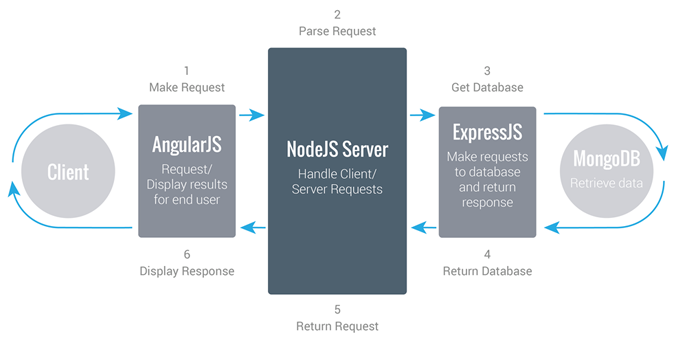

Nos dias 25 de Junho e 30 de Julho, tive o prazer de ministrar um treinamento completo sobre MEAN Stack na FCamara, consultoria de software onde trabalho atualmente, com muitos Hands on e interatividade com os participantes.

Com aproximadamente 6 horas de duração em cada uma das datas, conseguimos explorar com detalhes cada uma das tecnologias e como já faz um tempo que não trago conteúdo para o blog, decidi trazer um resumo sobre as tecnologias vistas, para então iniciar uma série completa de artigos sobre a stack.

#### **O que é MEAN Stack ?**

MEAN Stack, é um acrônimo para MongoDB, Express.JS, AngularJS e Node.JS, conjunto de tecnologias que utilizam javascript tanto no client quanto no server para a construção de aplicações, de forma simples e rápida. De forma prática, uma aplicação que utiliza todas estas possibilidades tem a seguinte estrutura:

#### **MongoDB**

Trata-se de um banco de dados NoSQL de altíssima performance, orientado à documentos e sem esquemas. O MongoDB é tido como um banco de dados que escala o universo, pela qualidade com a qual trabalha com réplicas e sharding. Seus documentos são armazenados em formato dinâmico utilizando o BSON, que se parece muito com o JSON que conhecemos, porém, com mais opções de suporte aos documentos.

#### **Mongoose**

Embora o MongoDB seja schemaless, contar com as facilidades que um ODM (Object Data Mapping) propõe, facilita enormemente a vida ao lidar com operações de banco de dados. Sendo assim, o Mongoose que foi criado para rodar com o Node.JS, auxilia o desenvolvedor a escrever comandos à serem executados no MongoDB incluindo uma série de funcionalidades, tais como: built-in type casting, validação de dados, construção de queries amigáveis, lógica de negócios e etc.

#### **Node.JS**

O Node.JS é um ambiente de execução javascript, construído sob o V8, motor javascript de alta performance do Google Chrome ! O fato de trabalhar orientado à eventos e sem bloqueio de I/O, faz com que obtenhamos extrema performance em nossas aplicações. Além disso, o Node conta com um gerenciador de pacotes (NPM) de comandos poderosos que sustenta uma comunidade muito ativa, com pelo menos 490 novos pacotes por dia e mais de 38 milhões de downloads somente neste ano de 2016.

Com o Node ínumeros tipos de aplicações, entretanto, devemos pensar cautelosamente em cenários onde faz-se necessário processamento intenso. Na série de artigos sobre esta tecnologia, teremos a oportunidade de explorar bem tais aplicações.

#### **Express.JS**

Definido como um "Framework web rápido, flexível e minimalista para Node.JS", conseguimos construir aplicações web extremamente rápidas. Além disso, o framework possibilita ao desenvolvedor, adicionar middlewares que complementam as necessidades do cotidiano, por exemplo: autenticação (passport, jsonwebtoken), logs (winston, morgan), segurança (helmet), sessions, cookies e etc.

#### **AngularJS**

Mantido pelo Google, o AngularJS é um framework javascript que auxilia o desenvolvedor na criação de single page applications (SPA). Com o objetivo de facilitar tanto o desenvolvimento quanto testes dos aplicativos, o framework possibilita a construção de aplicações MV-*, além de, estender o HTML e promover o Two Way data-binding o framework fornece funcionalidas poderosas para encorajar o baixo acoplamento entre apresentação, dados e componentes lógicos.

Nos próximos dias, daremos início a uma série de artigos sobre cada tecnologia em específico, criando uma aplicação robusta envolvendo a maior quantidade possível de detalhes para demonstrar o poder desta stack. 

Nos vemos em breve :)

#### **Referências:**

- [Github com slides e exemplos de código](https://github.com/livertonli12/Treinamento-MEAN-Stack)
- [MongoDB](https://www.mongodb.com/)
- [Mongoose](http://mongoosejs.com/)
- [Node.JS](https://nodejs.com)
- [AngularJS](https://angularjs.org/)